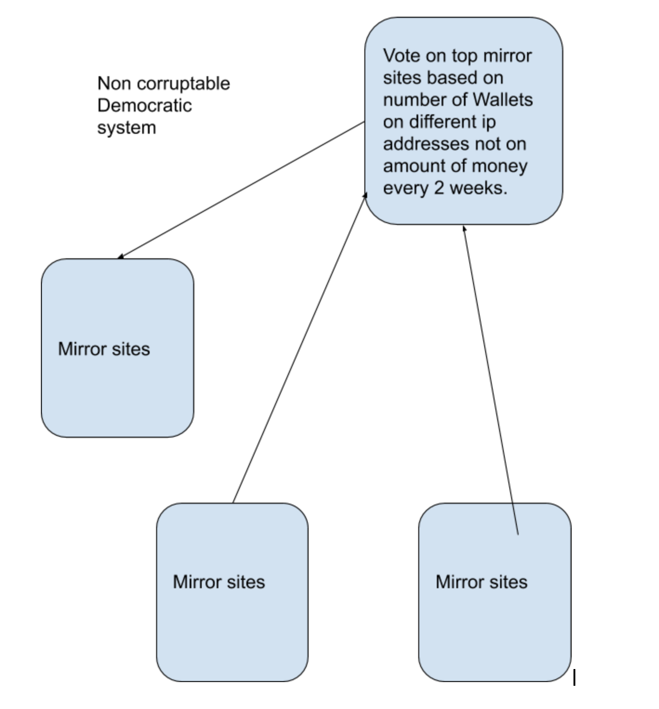

# Wiki Leaks on a Blockchain for whistle blowers

#Basic System:

#Voting System:
- Eliminated corruption and incentivises transparency

#Features

- login
- upload whistle-blower material wikileaks
- download leak
- share on social media
- verify leaks and add evidence
- host a mirror site
- earn revenue (bitcoin, ETH, other)
- get advertisers and sponsors from transparent sources.

